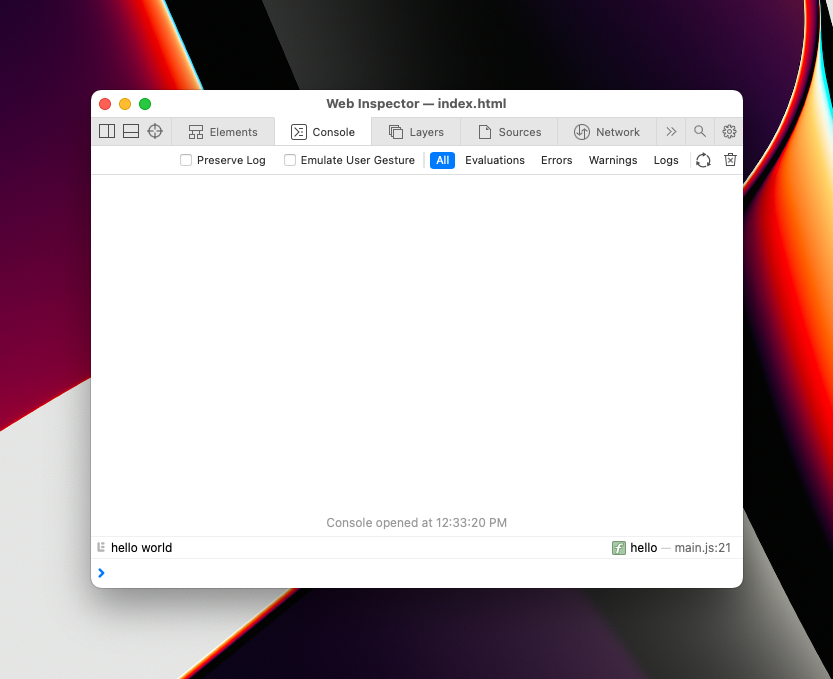
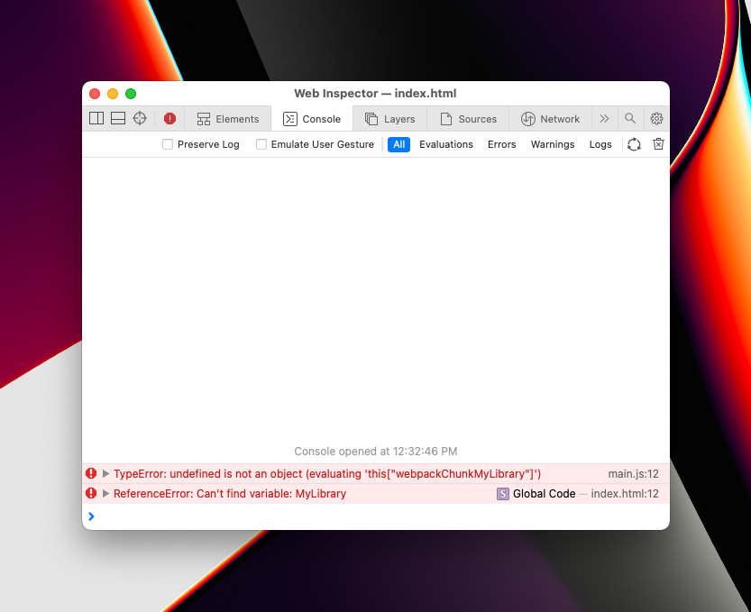

# Issue

Using a combination of `globalObject: 'this'` and `runtimeChunk: 'single'` causes the following error when 
including the generated code in a browser:
```
TypeError: undefined is not an object (evaluating 'this["webpackChunkMyLibrary"]')
```

This issue started on Webpack v5.47.0.

# Steps to reproduce

1. Run `yarn && yarn webpack` to build `dist/{main.js,runtime.js}`
2. Run `open dist/index.html` to see the results in a browser

# Expected result

I see the text "hello world" printed to the console.



# Actual result



I see the following error when  including the generated code in a browser:
```
TypeError: undefined is not an object (evaluating 'this["webpackChunkMyLibrary"]')
```

# NOTE

You can see how the generated `main.js` file changes from Webpack v5.46 -> v5.47.0 here:
https://github.com/jluxenberg/webpack-use-strict-bug-report/commit/9e0615d27cfd64423a63caa57d1ebf8592df5685

I believe the issue is the "use strict" at the top level causes "this" to NOT be set to `window` in the browser environment. See https://developer.mozilla.org/en-US/docs/Web/JavaScript/Reference/Strict_mode#securing_javascript for more details.